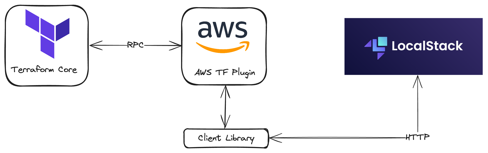

# Terraform AWS LocalStack

Click the button below to start a new development environment: \

> ℹ️ To switch to an OpenTofu context, execute the `make switch-tofu` command from the Terraform context (main branch).

## Illustration

> ⚠️ In this project, i'm manually configuring the link between Terraform and Localstack as an AWS Provider.  You can keep your production configurations and use the [terraform-local](#terraform-local) binary instead of `terraform`.

## [terraform-local][terraform-local-gh]
This is a python program developed by LocalStack that automatically configures Terraform (S3 Backend, AWS Provider Block) to use LocalStack as an AWS provider.

With this program, there's no need to modify AWS Provider or S3 Backend configurations. However, you'll need to use the `tflocal` binary instead of `terraform`.

It uses the [Terraform Override mechanism][terraform-override-mechanism-doc] and creates a temporary file `localstack_providers_override.tf` to configure the endpoints for the AWS provider section. The endpoints for all services are configured to point to the LocalStack API (http://localhost:4566 by default).

<!-- Links-->
[terraform-local-gh]: https://github.com/localstack/terraform-local
[terraform-override-mechanism-doc]:https://developer.hashicorp.com/terraform/language/files/override